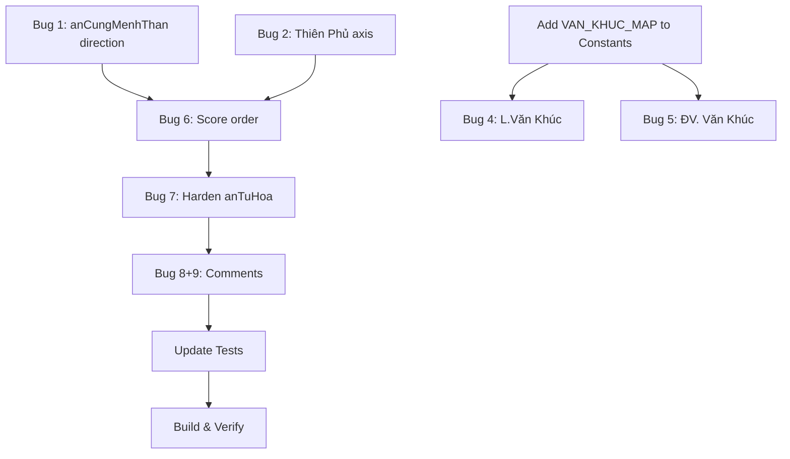

# 🎨 DESIGN: Fix Tử Vi Logic Bugs

Ngày tạo: 2026-03-07
Dựa trên: [implementation_plan.md](file:///home/skul9x/.gemini/antigravity/brain/552c7a88-0bb0-421a-8767-3a4d25b87737/implementation_plan.md)

---

## 1. Tổng Quan Thay Đổi

9 bugs sửa trên **2 files** chính:

| File | Bugs | Thay đổi |
|------|------|----------|
| [TuViLogic.kt](file:///home/skul9x/Desktop/Test_code/TuViAndroid-main/app/src/main/java/com/example/tviai/core/TuViLogic.kt) | 1,2,4,5,6,7,9 | 7 chỗ sửa |
| [Constants.kt](file:///home/skul9x/Desktop/Test_code/TuViAndroid-main/app/src/main/java/com/example/tviai/core/Constants.kt) | 4,5,8 | Thêm VAN_KHUC_MAP |

---

## 2. Thiết Kế Chi Tiết Từng Fix

### 🔴 Bug 1: anCungMenhThan — Chiều gán cung

**Vấn đề:** Code gán 12 cung chức năng theo chiều **thuận** (dòng 180), đúng ra phải **nghịch**.

**Quy tắc chuẩn:**
```
Mệnh → Phụ Mẫu → Phúc Đức → Điền Trạch → Quan Lộc → Nô Bộc
    → Thiên Di → Tật Ách → Tài Bạch → Tử Tức → Phu Thê → Huynh Đệ
```
Mệnh ở cung nào thì sa **nghịch chiều** (giảm index) gán tiếp.

**Fix:**

```diff
 // TuViLogic.kt, line 180
-var p = (menhPos + i) % 12
+var p = (menhPos - i + 12) % 12
```

**Verify:** Nếu Mệnh ở Tý (0):
- `(0 - 0 + 12) % 12 = 0` → Mệnh tại Tý ✓
- `(0 - 1 + 12) % 12 = 11` → Phụ Mẫu tại Hợi ✓
- `(0 - 2 + 12) % 12 = 10` → Phúc Đức tại Tuất ✓

Dòng 181 `if (p < 0) p += 12` **có thể bỏ** vì `+12` đã handle, nhưng giữ lại cũng không sao (safety net).

---

### 🔴 Bug 2: anChinhTinh — Trục đối xứng Thiên Phủ

**Vấn đề:** Thiên Phủ đối xứng Tử Vi qua **trục Dần(2)–Thân(8)**.

**Công thức đúng:** `ThienPhu = (2 + 8 - TuVi) % 12 = (10 - TuVi) % 12`

**Fix:**

```diff
 // TuViLogic.kt, line 278
-var thienFuPos = (4 - tuViPos) % 12
+var thienFuPos = (10 - tuViPos) % 12
```

**Verify bằng bảng đối xứng:**

| Tử Vi tại | Thiên Phủ tại | `(10 - TV) % 12` |
|-----------|--------------|-------------------|
| Dần (2) | Thân (8) | `(10-2)%12 = 8` ✓ |
| Mão (3) | Mùi (7) | `(10-3)%12 = 7` ✓ |
| Thìn (4) | Ngọ (6) | `(10-4)%12 = 6` ✓ |
| Tỵ (5) | Tỵ (5) | `(10-5)%12 = 5` ✓ |
| Ngọ (6) | Thìn (4) | `(10-6)%12 = 4` ✓ |
| Mùi (7) | Mão (3) | `(10-7)%12 = 3` ✓ |
| Thân (8) | Dần (2) | `(10-8)%12 = 2` ✓ |
| Dậu (9) | Sửu (1) | `(10-9)%12 = 1` ✓ |
| Tuất (10) | Tý (0) | `(10-10)%12 = 0` ✓ |
| Hợi (11) | Hợi (11) | `(10-11)%12 = -1 → +12 = 11` ✓ |
| Tý (0) | Tuất (10) | `(10-0)%12 = 10` ✓ |
| Sửu (1) | Dậu (9) | `(10-1)%12 = 9` ✓ |

Tất cả 12 trường hợp khớp hoàn hảo.

---

### 🔴 Bug 3: anCuc — Verify formula

**Phân tích hiện tại:**

Code dùng Ngũ Hổ Độn để tìm Can Mệnh, rồi ánh xạ:
```kotlin
val valCan = (canMenhIndex / 2) + 1   // 0→1, 1→1, 2→2, 3→2, 4→3, 5→3, 6→4, 7→4, 8→5, 9→5
val valChi = when (chiMenhIndex) {
    0, 1, 6, 7 -> 0   // Tý Sửu Ngọ Mùi
    2, 3, 8, 9 -> 1   // Dần Mão Thân Dậu
    else -> 2          // Thìn Tỵ Tuất Hợi
}
total = valCan + valChi   // if > 5 → total -= 5
// 1=Kim, 2=Thủy, 3=Hỏa, 4=Thổ, 5=Mộc
```

**Kiểm tra manual:**

| Test | Can năm | Mệnh tại | Can Mệnh | valCan | valChi | Total | Cục | Đúng? |
|------|---------|----------|----------|--------|--------|-------|-----|-------|
| Nhâm Thân 1992, Mệnh Mão | Nhâm(8) | Mão(3) | startCan=8, dist=1 → `(8+1)%10=9` Quý | `(9/2)+1=5` | `1` | `6→1` | Kim 4 | ✅ |

**Kết luận:** Formula hiện tại **có vẻ đúng** cho case đã test. Nhưng vẫn nên write thêm unit test cho nhiều trường hợp để chắc chắn. **Không cần fix ngay**, chỉ cần test coverage.

---

### 🟡 Bug 4 & 5: Văn Khúc Map (Lưu + Đại Vận)

**Quy tắc Văn Khúc (theo Can):**

Sao Văn Khúc khi an theo Can (cho Lưu Niên / Đại Vận) khác với Văn Khúc giờ sinh. Dùng map riêng:

```kotlin
// Constants.kt — Thêm map mới
val VAN_KHUC_MAP = mapOf(
    0 to 9,  // Giáp → Dậu
    1 to 8,  // Ất → Thân
    2 to 6,  // Bính → Ngọ
    3 to 5,  // Đinh → Tỵ
    4 to 6,  // Mậu → Ngọ
    5 to 5,  // Kỷ → Tỵ
    6 to 3,  // Canh → Mão
    7 to 2,  // Tân → Dần
    8 to 3,  // Nhâm → Mão
    9 to 11  // Quý → Hợi
)
```

> [!NOTE]
> Map này đối xứng với VAN_TINH_MAP (Văn Xương). Xương thuận Khúc nghịch trên cùng vòng.

**Fix anSaoLuu (dòng 921-927):**

```diff
-if (canNamXemIndex == 2) { // Bính
-    cungList[6].phuTinh.add("L.Văn Khúc") // Ngọ
-} else {
-     // Generic fallback if needed later
-}
+com.example.tviai.core.Constants.VAN_KHUC_MAP[canNamXemIndex]?.let { pos ->
+    cungList[pos].phuTinh.add("L.Văn Khúc")
+}
```

**Fix anSaoDaiVan (dòng 808-812):**

```diff
-if (canDaiVan == 9) { // Quý
-    cungList[11].phuTinh.add("ĐV. Văn Khúc") // Hợi
-}
+com.example.tviai.core.Constants.VAN_KHUC_MAP[canDaiVan]?.let { pos ->
+    cungList[pos].phuTinh.add("ĐV. Văn Khúc")
+}
```

---

### 🟡 Bug 6: calculateScores sau anDoSang

**Vấn đề:** `anDoSang` chuyển `"Tử Vi"` → `"Tử Vi (M)"`. `STAR_SCORES` tra `"Tử Vi (M)"` → null → 0 điểm.

**Fix đơn giản nhất:** Đổi thứ tự trong `anSao()`:

```diff
 // TuViLogic.kt, lines 120-125
-// 5.9 Attach Brightness (Miếu/Vượng...)
-anDoSang(cungList)
-
 // 6. Calculate Scores
 val scores = calculateScores(cungList)
+
+// 5.9 Attach Brightness (Miếu/Vượng...) — AFTER scores
+anDoSang(cungList)
```

**Tại sao chọn cách này:** Không cần sửa logic `calculateScores` hay `STAR_SCORES`. Score cần tên gốc, display cần tên có độ sáng → tính score trước, gán brightness sau.

---

### 🟡 Bug 7: anTuHoa — Harden lookup

**Fix:** Dùng `startsWith` thay vì `contains` cho chính tinh (phòng khi tên bị modify):

```diff
 // TuViLogic.kt, line 439
-if (cung.chinhTinh.contains(starName)) {
+if (cung.chinhTinh.any { it == starName || it.startsWith(starName) }) {
```

> [!NOTE]
> Hiện tại `anTuHoa` chạy TRƯỚC `anDoSang` nên chưa bị lỗi. Fix này là phòng ngừa khi refactor thứ tự trong tương lai.

---

### 🟢 Bug 8: DAO_HOA_MAP comment

Chỉ sửa comment cho đúng thứ tự nhóm:

```diff
-8 to 9, 0 to 9, 4 to 9   // Than Ty Thin -> Dau
+8 to 9, 0 to 9, 4 to 9   // Thân(8) Tý(0) Thìn(4) -> Dậu
```

---

### 🟢 Bug 9: Thiên Y

Thêm comment ghi chú trường phái:

```diff
 cungList[rieuPos].phuTinh.add("Thiên Y")
+// Note: Thiên Y đồng cung Thiên Riêu (trường phái Tháng).
+// Trường phái khác: Thiên Y theo Can Năm.
```

---

## 3. Thứ Tự Thực Hiện



## 4. Files Bị Ảnh Hưởng

| File | Dòng sửa | Mục đích |
|------|----------|----------|
| `TuViLogic.kt:180` | `menhPos + i` → `menhPos - i + 12` | Bug 1 |
| `TuViLogic.kt:278` | `4 - tuViPos` → `10 - tuViPos` | Bug 2 |
| `TuViLogic.kt:120-125` | Swap order `scores` ↔ `anDoSang` | Bug 6 |
| `TuViLogic.kt:439` | `contains` → `startsWith` | Bug 7 |
| `TuViLogic.kt:808-812` | Hardcode → VAN_KHUC_MAP | Bug 5 |
| `TuViLogic.kt:921-927` | Hardcode → VAN_KHUC_MAP | Bug 4 |
| `TuViLogic.kt:575` | Add comment | Bug 9 |
| `Constants.kt` | Add VAN_KHUC_MAP | Bug 4,5 |
| `Constants.kt:198` | Fix comment | Bug 8 |
| `TuViLogicTest.kt` | Update expected values | All |

---

*Tạo bởi AWF — Design Phase*
